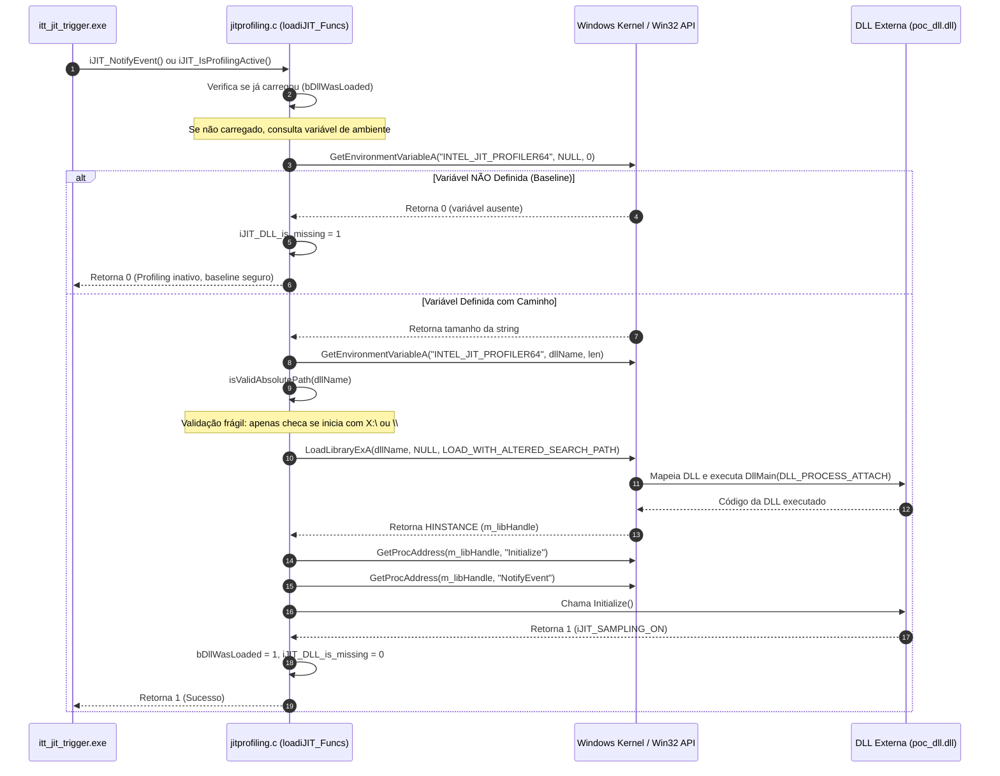

# Análise Técnica de Segurança: CWE-427 no JIT Profiling Intel ITT (OpenCV)

Este documento aprofunda o mecanismo de funcionamento, a análise técnica das flags do Windows e o vetor de vulnerabilidade **CWE-427 (*Uncontrolled Search Path Element*)** identificado no módulo `3rdparty/ittnotify/src/ittnotify/jitprofiling.c` integrado ao OpenCV.

---

## 1. Visão Geral da Arquitetura: Intel ITT e JIT Profiling

O Intel Instrumentation and Tracing Technology (ITT) API é uma biblioteca da Intel incorporada ao OpenCV para coletar métricas de desempenho e profiling através de ferramentas como **Intel VTune Profiler**.

Dentro da pasta `3rdparty/ittnotify`, existem dois subsistemas distintos:
1. **ITTNotify Core (`ittnotify_static.c`)**: Responsável por marcadores de timeline, contadores, tarefas e agrupamentos de profiling geral (usa as variáveis de ambiente `INTEL_LIBITTNOTIFY32` / `INTEL_LIBITTNOTIFY64`).
2. **JIT Profiling Agent (`jitprofiling.c`)**: Responsável por notificar o profiler sobre código gerado ou compilado dinamicamente (*Just-In-Time*). Ele foi projetado para carregar um coletor externo em tempo de execução via biblioteca dinâmica (DLL no Windows, `.so` no Linux/Android).

Historicamente, o código da Intel carregava uma biblioteca fixa chamada **`BistroJavaCollector.dll`** (mencionada explicitamente no comentário da linha 54 de `jitprofiling.c`):
```c
/* loadiJIT_Funcs() : this function is called just in the beginning
 * and is responsible to load the functions from BistroJavaCollector.dll
 */
```
Com a evolução do VTune, a Intel adicionou a capacidade de trocar dinamicamente o coletor sem recompilar o binário, introduzindo a macro `NEW_DLL_ENVIRONMENT_VAR` para ler o caminho de uma DLL externa a partir de uma variável de ambiente.

---

## 2. Como é Feita a Troca da DLL (Fluxo Passo a Passo)

### 2.1. Seleção da Variável em Tempo de Compilação
No arquivo `3rdparty/ittnotify/src/ittnotify/jitprofiling.c` (linhas 23–29):
```c
#ifndef NEW_DLL_ENVIRONMENT_VAR
#if ITT_ARCH==ITT_ARCH_IA32
#define NEW_DLL_ENVIRONMENT_VAR         "INTEL_JIT_PROFILER32"
#else
#define NEW_DLL_ENVIRONMENT_VAR         "INTEL_JIT_PROFILER64"
#endif
#endif
```
* Em builds de **32 bits** (`x86`), a variável lida é `INTEL_JIT_PROFILER32`.
* Em builds de **64 bits** (`x64`), a variável lida é `INTEL_JIT_PROFILER64`.

### 2.2. O Mecanismo de Inicialização (`loadiJIT_Funcs`)
O carregamento segue a seguinte máquina de estados:



---

## 3. A Flag do Windows: `LOAD_WITH_ALTERED_SEARCH_PATH`

A chamada crítica em `jitprofiling.c` (linha 195) é:
```c
m_libHandle = LoadLibraryExA(dllName, NULL, LOAD_WITH_ALTERED_SEARCH_PATH);
```

Para entender por que essa flag é perigosa quando combinada com entrada não confiável, é preciso comparar a **ordem de busca padrão do Windows** com a **ordem alterada**.

### 3.1. Ordem de Busca Padrão do Windows (*Standard DLL Search Order*)
Quando uma aplicação chama `LoadLibraryA("minha.dll")` ou `LoadLibraryExA` sem flags de alteração de caminho, o Windows procura a DLL e quaisquer dependências na seguinte ordem:

1. **Diretório do Executável**: A pasta onde reside o `.exe` que iniciou o processo.
2. **Diretório do Sistema (`System32`)**: `C:\Windows\System32`.
3. **Diretório do Sistema de 16 bits**: `C:\Windows\System` (legado).
4. **Diretório do Windows**: `C:\Windows`.
5. **Diretório de Trabalho Atual (Current Working Directory - CWD)**: A pasta de onde o comando foi invocado.
6. **Diretórios na variável de ambiente `%PATH%`**.

### 3.2. O que a flag `LOAD_WITH_ALTERED_SEARCH_PATH` (0x00000008) faz?
De acordo com a [documentação técnica oficial da Microsoft para LoadLibraryEx](https://learn.microsoft.com/windows/win32/api/libloaderapi/nf-libloaderapi-loadlibraryexa):

> *"If this value is used and `lpLibFileName` specifies an absolute path, the system uses the alternate search strategy... The directory that contains the specified module is searched instead of the directory of the executable."*

Quando `LOAD_WITH_ALTERED_SEARCH_PATH` está ativo:
1. O diretório onde a DLL alvo está gravada **substitui** o diretório do executável como o **primeiro local** pesquisado para resolver todas as dependências daquela DLL.
2. Se a DLL carregar recursivamente outras dependências (por exemplo, chamando `LoadLibrary` implícito via Import Table), o Windows buscará primeiro nessa pasta controlada pelo usuário.

### 3.3. Por que isso agrava a vulnerabilidade?
1. **Quebra de Isolamento do Processo**: Se um invasor puder controlar a pasta onde a DLL está gravada (por exemplo, `C:\Users\Public\poc.dll` ou um compartilhamento de rede SMB `\\atacante\share\poc.dll`), ele pode também colocar arquivos com nomes idênticos a DLLs de sistema (`version.dll`, `uxtheme.dll`, etc.) na mesma pasta.
2. **DLL Planting / DLL Side-Loading**: O Windows carregará as dependências da pasta do invasor antes de consultar as pastas oficiais do sistema operacional.
3. **Advertência Explícita da Microsoft**:
   > *"Do not use `LOAD_WITH_ALTERED_SEARCH_PATH` with relative paths or untrusted directories. Doing so can cause the application to load an unintended DLL, resulting in security vulnerabilities."*

---

## 4. Análise da Validação: Por que `isValidAbsolutePath()` Falha?

No arquivo `jitprofiling.c` (linhas 118–146):
```c
static int isValidAbsolutePath(char *path, size_t maxPathLength)
{
    ...
    if (pathLength > 2)
    {
        if (isalpha(path[0]) && path[1] == ':' && path[2] == '\\')
        {
            return 1;
        }
        else if (path[0] == '\\' && path[1] == '\\')
        {
            return 1;
        }
    }
    return 0;
}
```

### Problemas Críticos dessa Verificação:
1. **Não restringe diretórios com permissão de escrita de usuários comuns**:
   Qualquer caminho como `C:\Users\marco\poc.dll`, `C:\Temp\poc.dll`, `C:\Users\Public\poc.dll` retorna `1` (`true`).
2. **Permite caminhos UNC de rede (`\\servidor\compartilhamento`)**:
   A condição `path[0] == '\\' && path[1] == '\\'` valida explicitamente caminhos UNC! Isso permite que o OpenCV tente carregar uma DLL diretamente de um servidor remoto SMB da internet ou da rede local.
3. **Não valida assinatura digital (Authenticode)**:
   Não há conferência se a DLL pertence à Intel, à Microsoft ou se é um executável malicioso recém-compilado.
4. **Não valida propriedade do arquivo (DACL / SACL)**:
   Não verifica se o arquivo pertence ao Administrador ou ao `NT AUTHORITY\SYSTEM`.

---

## 5. Resultados Práticos dos Testes Executados no Sample

Os testes foram conduzidos e validados através dos scripts [run_test.bat](file:///c:/Users/marco/source/repos/opencv/samples/itt_jit_trigger/run_test.bat) e das configurações de depuração no Visual Studio ([launch.vs.json](file:///c:/Users/marco/source/repos/opencv/samples/itt_jit_trigger/.vs/launch.vs.json)):

| Teste | Variável `INTEL_JIT_PROFILER64` | Retorno da API | Comportamento Observado |
| :--- | :--- | :--- | :--- |
| **1. Baseline** | *Não definida* (Vazia) | `0` | Nenhuma DLL externa é carregada. O sistema opera normalmente sem profiling. Nenhum arquivo criado. |
| **2. Injeção PoC** | `C:\...\bin\poc_dll.dll` | `1` | `LoadLibraryExA` carrega a DLL. `DllMain` executa imediatamente no anexo do processo. O arquivo de prova `POC_DLL_INJECTION_PROOF.txt` é gerado. |

### Conteúdo Comprovatório Gerado pelo Teste:
```text
[POC INJECTION PROOF] Lib carregada com sucesso! Chamador: DllMain(DLL_PROCESS_ATTACH) | Horario: Tue Sep 15 17:23:42 2026
[POC INJECTION PROOF] Lib carregada com sucesso! Chamador: Initialize() | Horario: Tue Sep 15 17:23:42 2026
```

---

## 6. Proposta de Correção (Mitigações Recomendadas)

Para neutralizar a vulnerabilidade CWE-427 sem quebrar a funcionalidade legítima do VTune Profiler:

### Abordagem 1: Restrição por Diretórios Seguros (Allowlist de Caminhos)
Em vez de aceitar qualquer caminho absoluto, exigir que a DLL esteja localizada em um diretório oficial do Intel VTune (ex: dentro de `Program Files` ou `Program Files (x86)`):
```c
static int isTrustedProfilerPath(const char* path)
{
    char programFiles[MAX_PATH];
    if (GetEnvironmentVariableA("ProgramFiles", programFiles, MAX_PATH)) {
        if (_strnicmp(path, programFiles, strlen(programFiles)) == 0)
            return 1;
    }
    return 0; // Rejeita qualquer caminho fora de pastas protegidas do sistema
}
```

### Abordagem 2: Uso de Flags Seguras da API Moderna do Windows
Substituir a flag perigosa `LOAD_WITH_ALTERED_SEARCH_PATH` por flags de mitigação seguras introduzidas pela Microsoft (`KB2533623`):
```c
m_libHandle = LoadLibraryExA(dllName, NULL, LOAD_LIBRARY_SEARCH_SYSTEM32 | LOAD_LIBRARY_SEARCH_USER_DIRS);
```

### Abordagem 3: Opção de Build para Desativação Estática
Permitir que usuários do OpenCV desabilitem o carregamento dinâmico do agente JIT via flag de compilação CMake:
```cmake
# No CMakeLists.txt do OpenCV:
option(OPENCV_ENABLE_ITT_DYNAMIC_PROFILER "Permite carregamento dinamico de agentes de profiling ITT" OFF)
```
Caso `OFF`, fixar `loadiJIT_Funcs()` para retornar sempre `0`, eliminando completamente o vetor de injeção em ambientes de produção.
